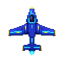
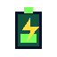
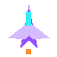
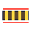

# Rio Arriba

## Play the game

Open the published game here:

[https://miguelelgallo.github.io/RioArriba/](https://miguelelgallo.github.io/RioArriba/)

Rio Arriba is a mobile-first arcade river shooter inspired by the original
[River Raid](https://en.wikipedia.org/wiki/River_Raid).

You fly an electric plane up a winding river.

You steer through narrow channels, destroy enemies, recharge before your energy
runs out, and break bridges to move to the next level.

The river gets tighter as you progress. Near bridges, it narrows into a funnel,
so you can feel the approach before the bridge appears.

## Icons and points

These are the main things you see in the game.

| Icon | Name | Points | What it means |
| --- | --- | ---: | --- |
|  | Electric plane | - | This is you. Keep it inside the river and protect your charge. |
|  | Charger | 80 | Fly over it slowly to recharge over time. You can also shoot it for points. |
|  | Barge | 30 | A river craft. Shoot it or avoid it. |
|  | Drone | 60 | A crossing aircraft threat. Shoot it before it blocks your path. |
|  | Jet | 100 | A faster aircraft threat. It becomes more common in later levels. |
|  | Bridge | 500 | Destroy it to finish the river and level up. Hitting it crashes the plane. |
|  | Life cell | - | You start with 3 lives. |
|  | Fire | - | Tap the fire area or press Space to shoot. |
|  | Slow | - | Slow down to steer carefully and recharge more. |
|  | Fast | - | Speed up when the river is open. |

On touch screens, keep one finger on the playfield and move it like a small
joystick.

Tap the right-side fire area with another finger to shoot.

On a keyboard, use the arrow keys to steer and change speed. Press `Space` to
fire.

## Run it locally

First, install the dependencies from the game folder:

```bash
cd apps/rio-arriba-game
npm install
```

Then start the local server:

```bash
npm run dev
```

Open the URL printed by Vite.

By default, it is:

```text
http://localhost:5173/
```

You can also run the checks:

```bash
npm test
npm run build
```

The game is built with Phaser, TypeScript, and Vite.
